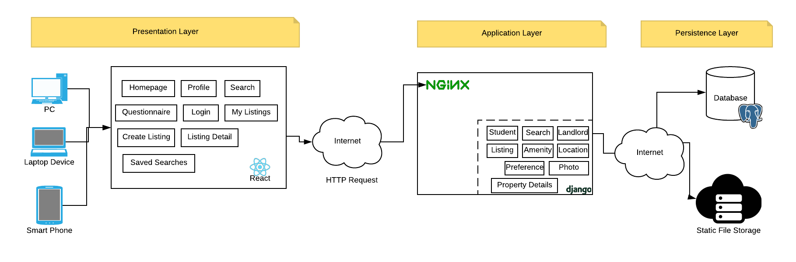

The following are diagrams outlining the classic Web-Application architecture. The architecture is 3-tier, with a presentation, application, and persistence layer(s). 

[View it on Lucid Chart](https://www.lucidchart.com/invitations/accept/d243e46e-bbed-4c70-8771-92917e276c4d)

### Image Sources

* https://www.flaticon.com/free-icon/cloud-networking_70613
* https://www.djangoproject.com/community/logos/
* https://commons.wikimedia.org/wiki/File:React-icon.svg
* https://commons.wikimedia.org/wiki/File:Nginx_logo.svg
* https://wiki.postgresql.org/wiki/Logo