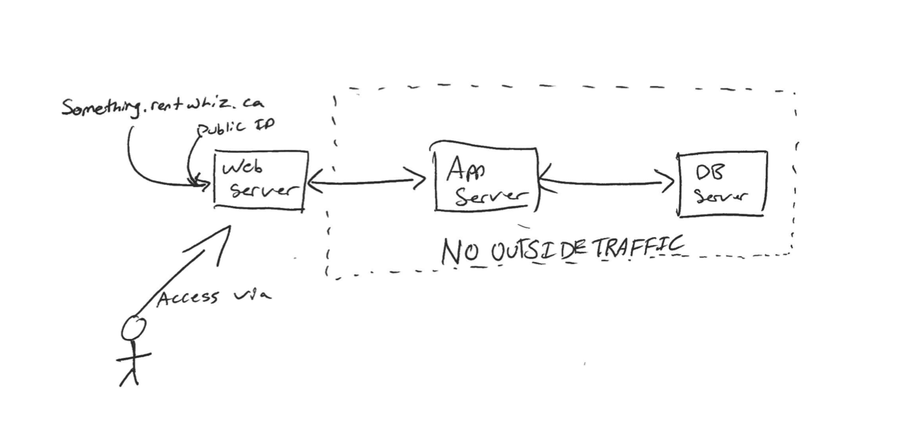

## Introduction 

A brief intro into our DevOps and Infrastructure practices. This doc is geared toward our setup in Cybera, but can be applied elsewhere.

### Useful links

[Cybera Login](https://cloud.cybera.ca/auth/login/?next=/)

### Diagram

### Web Server

Our web server is the front of the whole operation. All traffic in and out of the website goes through here. Due to the limitation of our Cybera account, allowing us to only have **one public IPv4 address**, both development and production traffic will be routed through here using their respective subdomain names. Each environment will be passed to their respective backends.

### App 

This is the meat of the operation. All the blood sweat and tears we put into the code runs here. This server is only accessible by other servers in our account. All outside traffic that gets routed to it first goes through the web server. 

### Database 

Where the data lies. The Database is hidden behind not only the web server, but also the app server. The app server is the only one that can communicate to it directly, while all outside traffic (like `pgadmin`) needs to ssh tunnel the traffic through the web instance. (More on that later)