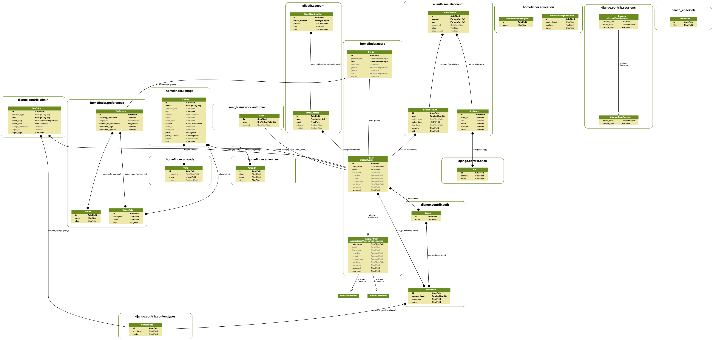
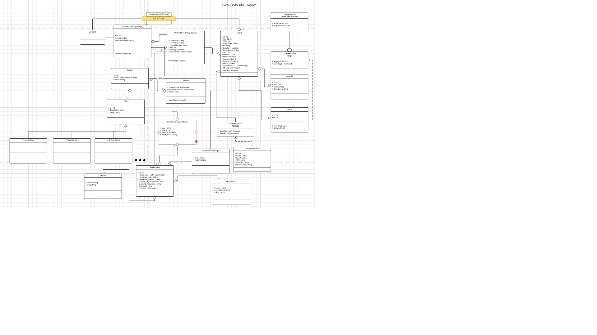
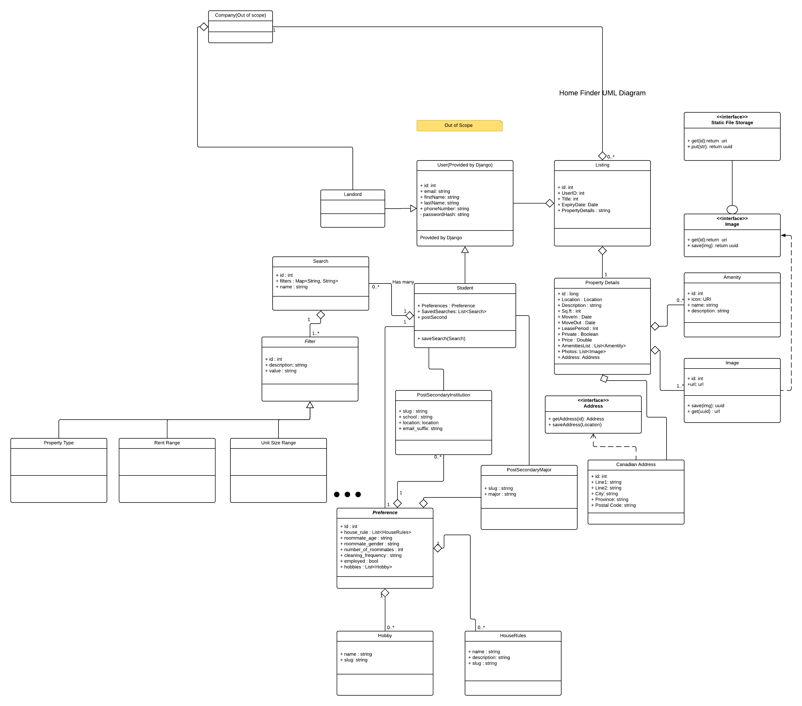
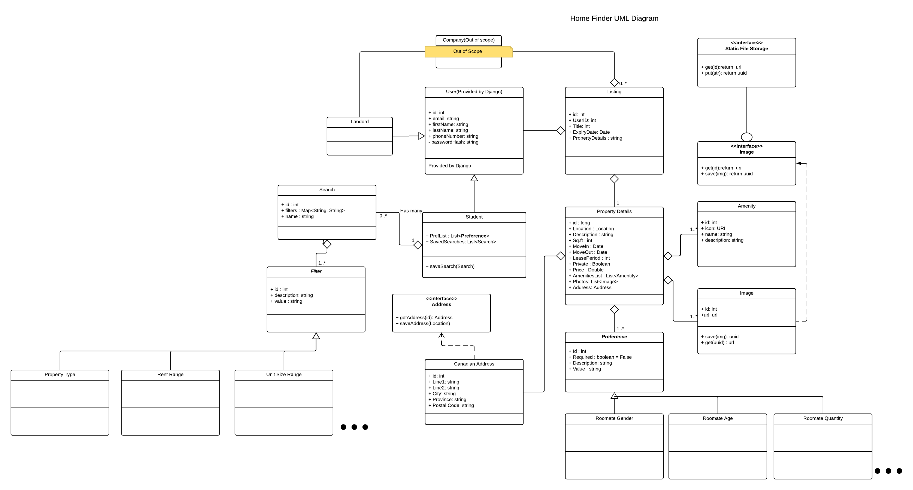
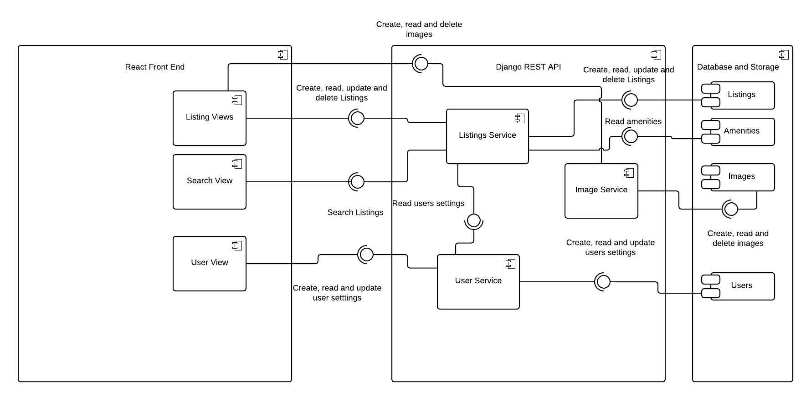

# UML

## Class Diagram
The following is a diagram representing classes and models.

[View it on Lucid Chart](https://www.lucidchart.com/invitations/accept/b81eb07c-2dac-4cbc-990c-52af563bd734)

### Sprint 4

### Sprint 3

### Sprint 2

### Sprint 1

## Component Diagram

[View it on Lucid Chart](https://www.lucidchart.com/invitations/accept/95d9a0d1-7bc0-41b5-8e6e-4c8761896674)

